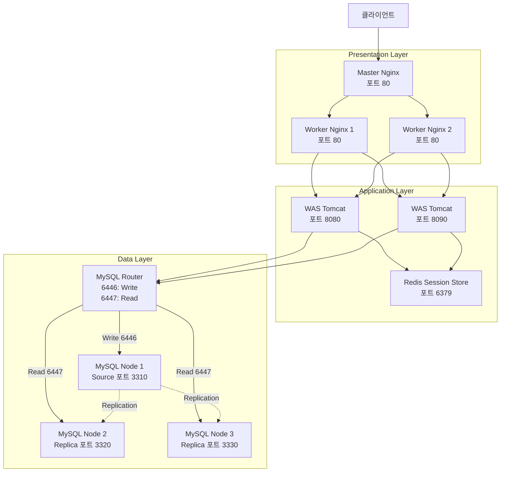

# Design Document: 3-Tier Architecture Documentation System

## Overview

이 설계 문서는 CardLedger 시스템의 3-tier 아키텍처를 문서화하는 시스템의 설계를 정의합니다. 문서화 시스템은 Markdown 형식으로 5개의 문서를 생성하며, 각 문서는 Mermaid 다이어그램과 설정 파일 설명을 포함합니다.

### 시스템 목표

- 전체 아키텍처와 각 계층의 구조를 명확하게 문서화
- Mermaid 다이어그램을 통한 시각적 표현 제공
- 설정 파일의 핵심 내용을 요약하여 이해도 향상
- 민감 정보 보호를 위한 안전한 문서화 프로세스

### 문서 구조

생성되는 5개의 문서:
1. `docs/architecture-overview.md` - 전체 시스템 아키텍처
2. `docs/presentation-layer.md` - Nginx 계층 (Master/Worker)
3. `docs/application-layer.md` - WAS 계층 (Tomcat + Filter Chain)
4. `docs/data-layer.md` - MySQL Cluster 계층
5. `docs/redis-session-store.md` - Redis 세션 저장소

## Architecture

### 전체 시스템 구조



### 요청 처리 흐름

1. **클라이언트 요청**: 외부 클라이언트가 포트 80으로 HTTP 요청 전송
2. **Master Nginx**: 요청을 2개의 Worker Nginx 인스턴스로 부하분산
3. **Worker Nginx**: 요청을 2개의 WAS 인스턴스로 부하분산
4. **WAS Filter Chain**: RedisSessionFilter → LoginSessionCheckFilter → EncodingFilter 순서로 필터 실행
5. **세션 관리**: Redis에서 세션 데이터 로드/저장
6. **데이터베이스 접근**: MySQL Router를 통해 쓰기(6446) 또는 읽기(6447) 요청 라우팅
7. **응답 반환**: 역순으로 응답이 클라이언트에게 전달

### 문서 생성 프로세스

```mermaid
flowchart LR
    Start[시작] --> ReadReq[요구사항 분석]
    ReadReq --> ScanFiles[설정 파일 스캔]
    ScanFiles --> GenArch[아키텍처 문서 생성]
    GenArch --> GenPres[Presentation 문서 생성]
    GenPres --> GenApp[Application 문서 생성]
    GenApp --> GenData[Data 문서 생성]
    GenData --> GenRedis[Redis 문서 생성]
    GenRedis --> Validate[문서 검증]
    Validate --> End[완료]
```



## Components and Interfaces

### DocumentationGenerator

문서 생성의 핵심 컴포넌트로, 각 계층의 문서를 생성하는 책임을 가집니다.

**책임**:
- 요구사항 문서 파싱
- 설정 파일 읽기 및 분석
- Mermaid 다이어그램 생성
- Markdown 문서 작성
- 민감 정보 필터링

**인터페이스**:
```typescript
interface DocumentationGenerator {
  generateArchitectureOverview(): string
  generatePresentationLayer(): string
  generateApplicationLayer(): string
  generateDataLayer(): string
  generateRedisDocument(): string
  validateDocument(content: string): ValidationResult
}
```

### ConfigurationParser

설정 파일을 읽고 핵심 정보를 추출하는 컴포넌트입니다.

**책임**:
- Nginx 설정 파일 파싱 (upstream, proxy 설정)
- MySQL 설정 파일 파싱 (server-id, replication 설정)
- web.xml 파싱 (filter chain 설정)
- 민감 정보 감지 및 마스킹

**인터페이스**:
```typescript
interface ConfigurationParser {
  parseNginxConfig(filePath: string): NginxConfig
  parseMySQLConfig(filePath: string): MySQLConfig
  parseWebXML(filePath: string): WebXMLConfig
  detectSensitiveInfo(content: string): string[]
}
```

### MermaidDiagramBuilder

Mermaid 다이어그램을 생성하는 컴포넌트입니다.

**책임**:
- flowChart 문법으로 다이어그램 생성
- 컴포넌트 간 연결 관계 표현
- 포트 번호 및 한글 레이블 추가
- 다이어그램 문법 검증

**인터페이스**:
```typescript
interface MermaidDiagramBuilder {
  buildArchitectureDiagram(): string
  buildPresentationDiagram(): string
  buildApplicationDiagram(): string
  buildDataDiagram(): string
  buildRedisDiagram(): string
  validateSyntax(diagram: string): boolean
}
```

### FileSystemManager

파일 시스템 작업을 담당하는 컴포넌트입니다.

**책임**:
- docs/ 디렉토리 생성
- 문서 파일 저장
- .kiroignore 파일 참조
- 파일 존재 여부 확인

**인터페이스**:
```typescript
interface FileSystemManager {
  createDocsDirectory(): void
  saveDocument(filename: string, content: string): void
  readConfigFile(filePath: string): string
  shouldIgnoreFile(filePath: string): boolean
}
```

## Data Models

### DocumentMetadata

각 문서의 메타데이터를 표현합니다.

```typescript
interface DocumentMetadata {
  title: string              // 문서 제목
  filename: string           // 저장될 파일명
  layer: LayerType          // 계층 타입
  createdAt: Date           // 생성 시간
  configFiles: string[]     // 참조하는 설정 파일 목록
}

enum LayerType {
  ARCHITECTURE = "architecture",
  PRESENTATION = "presentation",
  APPLICATION = "application",
  DATA = "data",
  REDIS = "redis"
}
```

### NginxConfig

Nginx 설정 파일의 핵심 정보를 표현합니다.

```typescript
interface NginxConfig {
  upstreamName: string           // upstream 블록 이름
  servers: UpstreamServer[]      // 백엔드 서버 목록
  listenPort: number             // listen 포트
  proxySettings: ProxySettings   // proxy 설정
}

interface UpstreamServer {
  host: string                   // 서버 호스트명
  port: number                   // 서버 포트
}

interface ProxySettings {
  proxyPass: string              // proxy_pass 값
  headers: Map<string, string>   // proxy_set_header 설정
}
```

### MySQLConfig

MySQL 설정 파일의 핵심 정보를 표현합니다.

```typescript
interface MySQLConfig {
  serverId: number               // server-id
  logBin: string                 // log-bin 설정
  gtidMode: boolean              // GTID 모드 활성화 여부
  binlogFormat: string           // binlog 포맷
  reportHost: string             // report-host
  role: MySQLRole                // Source 또는 Replica
}

enum MySQLRole {
  SOURCE = "source",
  REPLICA = "replica"
}
```

### WebXMLConfig

web.xml의 필터 체인 정보를 표현합니다.

```typescript
interface WebXMLConfig {
  filters: FilterDefinition[]    // 필터 정의 목록
  filterMappings: FilterMapping[] // 필터 매핑 목록
  distributable: boolean         // 세션 클러스터링 활성화 여부
}

interface FilterDefinition {
  name: string                   // 필터 이름
  className: string              // 필터 클래스명
  order: number                  // 실행 순서
}

interface FilterMapping {
  filterName: string             // 필터 이름
  urlPattern: string             // URL 패턴
}
```

### MermaidDiagram

생성된 Mermaid 다이어그램을 표현합니다.

```typescript
interface MermaidDiagram {
  type: string                   // 다이어그램 타입 (flowchart)
  content: string                // 다이어그램 내용
  nodes: DiagramNode[]           // 노드 목록
  edges: DiagramEdge[]           // 엣지 목록
}

interface DiagramNode {
  id: string                     // 노드 ID
  label: string                  // 노드 레이블 (한글)
  shape: string                  // 노드 모양
}

interface DiagramEdge {
  from: string                   // 시작 노드 ID
  to: string                     // 종료 노드 ID
  label?: string                 // 엣지 레이블 (선택)
}
```


## Correctness Properties

*A property is a characteristic or behavior that should hold true across all valid executions of a system-essentially, a formal statement about what the system should do. Properties serve as the bridge between human-readable specifications and machine-verifiable correctness guarantees.*

### Property 1: All documents contain Korean content

*For any* generated document (architecture, presentation, application, data, or Redis), the document content SHALL contain Korean characters (Hangul Unicode range U+AC00 to U+D7AF).

**Validates: Requirements 1.2, 6.3**

### Property 2: All documents use valid Markdown format

*For any* generated document, the document SHALL be parseable as valid Markdown syntax without errors.

**Validates: Requirements 6.1**

### Property 3: Architecture document contains all major components

*For any* generated architecture document, the document SHALL contain mentions of all six major components: Master_Nginx, Worker_Nginx, WAS, MySQL_Router, MySQL_Cluster, and Redis.

**Validates: Requirements 1.3**

### Property 4: Architecture document includes complete request flow diagram

*For any* generated architecture document, the Mermaid diagram SHALL include nodes representing the complete request flow from Client through Presentation layer, Application layer, to Data layer.

**Validates: Requirements 1.1, 1.4**

### Property 5: Component references link to layer documents

*For any* component mentioned in the architecture document that has configuration files, the document SHALL reference the corresponding Layer_Document for detailed information.

**Validates: Requirements 1.5**

### Property 6: Presentation layer diagram shows load balancing topology

*For any* generated presentation layer document, the Mermaid diagram SHALL show Master_Nginx connecting to Worker_Nginx instances AND Worker_Nginx instances connecting to WAS instances.

**Validates: Requirements 2.2, 2.3**

### Property 7: Application layer diagram shows WAS connections

*For any* generated application layer document, the Mermaid diagram SHALL show WAS instances (with ports 8080 and 8090) connecting to both Redis and MySQL_Router.

**Validates: Requirements 3.2**

### Property 8: Data layer diagram shows read/write separation

*For any* generated data layer document, the Mermaid diagram SHALL show MySQL_Router with separate connections to Source node (write) and Replica nodes (read).

**Validates: Requirements 4.2**

### Property 9: Redis diagram shows session sharing topology

*For any* generated Redis document, the Mermaid diagram SHALL show Redis connecting to both WAS instances.

**Validates: Requirements 5.2**

### Property 10: Layer documents follow consistent section ordering

*For any* generated layer document (presentation, application, data, or Redis), the document sections SHALL appear in this order: Mermaid diagram section, functionality description section, key files list section, configuration details section.

**Validates: Requirements 6.2**

### Property 11: All Mermaid diagrams use flowChart syntax

*For any* Mermaid diagram in any generated document, the diagram SHALL start with "flowchart" or "flowChart" keyword and be syntactically valid for Mermaid parsers.

**Validates: Requirements 9.1, 9.7**

### Property 12: Mermaid diagrams include Korean labels and port numbers

*For any* Mermaid diagram, node labels SHALL contain Korean characters AND network service nodes SHALL include their port numbers.

**Validates: Requirements 9.2, 9.3**

### Property 13: Mermaid diagrams use arrows for flow direction

*For any* Mermaid diagram showing request flow, the diagram SHALL use arrow syntax (-->, -.-> etc.) to indicate direction of requests between components.

**Validates: Requirements 9.4**

### Property 14: Mermaid diagrams use subgraphs for layer grouping

*For any* architecture overview diagram, the diagram SHALL use subgraph syntax to group components by layer (Presentation, Application, Data).

**Validates: Requirements 9.5**

### Property 15: Multiple component instances shown separately

*For any* component with multiple instances (Worker_Nginx, WAS, MySQL Replica), the Mermaid diagram SHALL show each instance as a separate node.

**Validates: Requirements 9.6**

### Property 16: All code blocks have language tags

*For any* code block in any generated document, the code block SHALL include a language tag (mermaid for diagrams, appropriate language for configuration files).

**Validates: Requirements 6.4, 6.5, 10.4**

### Property 17: All listed files include path and Korean description

*For any* file listed in any generated document, the listing SHALL include the complete file path AND a one-line description in Korean.

**Validates: Requirements 2.6, 2.7, 3.6, 4.8, 4.9, 4.10, 6.6, 10.2**

### Property 18: Configuration files include key parameters with descriptions

*For any* configuration file referenced in a layer document, the document SHALL include key configuration parameters (upstream servers, ports, server-id, replication settings as applicable) with one-line Korean descriptions.

**Validates: Requirements 2.8, 4.11, 10.1, 10.3**

### Property 19: Configuration excerpts are partial, not complete

*For any* configuration file content shown in a document, the content length SHALL be less than the original file length (showing only relevant excerpts).

**Validates: Requirements 10.5**

### Property 20: Filter chain order is correctly documented

*For any* application layer document, the filter chain description SHALL list filters in the correct execution order: RedisSessionFilter → LoginSessionCheckFilter → EncodingFilter.

**Validates: Requirements 3.4**

### Property 21: All filter classes are documented with roles

*For any* application layer document, the document SHALL list all three filter classes (RedisSessionFilter, LoginSessionCheckFilter, EncodingFilter) with their respective roles.

**Validates: Requirements 3.8**

### Property 22: MySQL Router ports are correctly described

*For any* data layer document, port 6446 SHALL be described as "Source (Write-only)" or equivalent Korean text AND port 6447 SHALL be described as "Replica (Read-only)" or equivalent Korean text.

**Validates: Requirements 4.4, 4.5**

### Property 23: MySQL nodes are correctly described with ports

*For any* data layer document, MySQL Node 1 SHALL be described as Source with port 3310 AND Nodes 2 and 3 SHALL be described as Replica with ports 3320 and 3330 respectively.

**Validates: Requirements 4.6, 4.7**

### Property 24: System never reads SQL files

*For any* file read operation during documentation generation, the file path SHALL NOT have a .sql extension.

**Validates: Requirements 7.1**

### Property 25: Sensitive information is detected and reported

*For any* configuration file content that contains sensitive information patterns (passwords, credentials, API keys), the system SHALL report the detection immediately.

**Validates: Requirements 7.2**

### Property 26: System respects .kiroignore exclusions

*For any* file listed in .kiroignore, the system SHALL NOT include that file in documentation generation.

**Validates: Requirements 7.3**

### Property 27: Sensitive data uses placeholder values

*For any* configuration example in documentation that requires sensitive data, the example SHALL use placeholder values (e.g., [password], [api_key]) instead of actual sensitive values.

**Validates: Requirements 7.4**

## Error Handling

### File System Errors

**Missing Configuration Files**:
- 상황: 요구사항에 명시된 설정 파일이 존재하지 않는 경우
- 처리: 경고 메시지를 출력하고 해당 파일을 "파일 없음"으로 표시하되, 문서 생성은 계속 진행
- 예시: "경고: docker/nginx/master-nginx.conf 파일을 찾을 수 없습니다"

**Directory Creation Failure**:
- 상황: docs/ 디렉토리 생성에 실패한 경우
- 처리: 오류 메시지를 출력하고 문서 생성 프로세스를 중단
- 예시: "오류: docs/ 디렉토리를 생성할 수 없습니다. 권한을 확인하세요"

**File Write Failure**:
- 상황: 생성된 문서를 파일로 저장할 수 없는 경우
- 처리: 오류 메시지를 출력하고 문서 내용을 콘솔에 출력
- 예시: "오류: docs/architecture-overview.md 저장 실패. 내용을 콘솔에 출력합니다"

### Configuration Parsing Errors

**Invalid Nginx Configuration**:
- 상황: Nginx 설정 파일의 문법이 올바르지 않은 경우
- 처리: 경고를 출력하고 파싱 가능한 부분만 문서화
- 예시: "경고: master-nginx.conf의 upstream 블록을 파싱할 수 없습니다"

**Invalid MySQL Configuration**:
- 상황: MySQL 설정 파일에서 필수 파라미터(server-id)를 찾을 수 없는 경우
- 처리: 경고를 출력하고 발견된 파라미터만 문서화
- 예시: "경고: node1.cnf에서 server-id를 찾을 수 없습니다"

**Invalid web.xml**:
- 상황: web.xml이 올바른 XML 형식이 아닌 경우
- 처리: 오류 메시지를 출력하고 필터 체인 정보를 "파싱 실패"로 표시
- 예시: "오류: web.xml XML 파싱 실패. 필터 체인 정보를 확인할 수 없습니다"

### Security Errors

**Sensitive Information Detected**:
- 상황: 설정 파일에서 비밀번호, API 키 등 민감 정보가 감지된 경우
- 처리: 즉시 경고 메시지를 출력하고 해당 정보를 플레이스홀더로 대체
- 예시: "보안 경고: docker-compose.yml에서 비밀번호가 감지되었습니다. [password]로 대체합니다"

**SQL File Access Attempt**:
- 상황: 시스템이 .sql 파일을 읽으려고 시도한 경우
- 처리: 접근을 차단하고 경고 메시지 출력
- 예시: "보안 경고: .sql 파일 접근이 차단되었습니다: init-root.sql"

### Diagram Generation Errors

**Invalid Mermaid Syntax**:
- 상황: 생성된 Mermaid 다이어그램의 문법이 올바르지 않은 경우
- 처리: 오류를 로깅하고 다이어그램 생성을 재시도. 3회 실패 시 기본 다이어그램 사용
- 예시: "오류: Mermaid 다이어그램 문법 오류. 재시도 중... (1/3)"

**Missing Component Information**:
- 상황: 다이어그램에 필요한 컴포넌트 정보(포트 번호 등)를 찾을 수 없는 경우
- 처리: 경고를 출력하고 기본값 사용 또는 정보 생략
- 예시: "경고: Worker Nginx 포트 정보를 찾을 수 없습니다. 기본값 80 사용"

### Validation Errors

**Document Validation Failure**:
- 상황: 생성된 문서가 요구사항을 충족하지 못한 경우
- 처리: 검증 실패 항목을 나열하고 사용자에게 수동 확인 요청
- 예시: "검증 실패: architecture-overview.md에 Redis 컴포넌트 설명이 누락되었습니다"

**Korean Content Missing**:
- 상황: 생성된 문서에 한글 콘텐츠가 없는 경우
- 처리: 오류 메시지를 출력하고 문서 생성 실패로 처리
- 예시: "오류: 생성된 문서에 한글 콘텐츠가 없습니다. 언어 설정을 확인하세요"

## Testing Strategy

### Dual Testing Approach

이 프로젝트는 단위 테스트(Unit Tests)와 속성 기반 테스트(Property-Based Tests)를 모두 사용하여 포괄적인 테스트 커버리지를 달성합니다.

**단위 테스트의 역할**:
- 특정 예제와 엣지 케이스 검증
- 파일 생성 및 저장 기능 테스트
- 컴포넌트 간 통합 지점 검증
- 오류 처리 로직 검증

**속성 기반 테스트의 역할**:
- 모든 입력에 대해 성립해야 하는 보편적 속성 검증
- 랜덤 입력을 통한 광범위한 입력 커버리지
- 문서 형식 및 구조의 일관성 검증
- 설정 파일 파싱의 견고성 검증

### Unit Testing Strategy

**DocumentationGenerator Tests**:
```typescript
describe('DocumentationGenerator', () => {
  test('creates docs directory if not exists', () => {
    // 특정 예제: docs/ 디렉토리가 없을 때 생성되는지 확인
  })
  
  test('generates all five required documents', () => {
    // 특정 예제: 5개 문서가 모두 생성되는지 확인
  })
  
  test('handles missing config file gracefully', () => {
    // 엣지 케이스: 설정 파일이 없을 때 경고 출력 확인
  })
  
  test('blocks access to .sql files', () => {
    // 보안 테스트: .sql 파일 접근 차단 확인
  })
})
```

**ConfigurationParser Tests**:
```typescript
describe('ConfigurationParser', () => {
  test('parses nginx upstream configuration', () => {
    // 특정 예제: 알려진 nginx 설정 파싱 확인
  })
  
  test('detects sensitive information in config', () => {
    // 보안 테스트: 비밀번호 패턴 감지 확인
  })
  
  test('handles malformed XML in web.xml', () => {
    // 엣지 케이스: 잘못된 XML 처리 확인
  })
})
```

**MermaidDiagramBuilder Tests**:
```typescript
describe('MermaidDiagramBuilder', () => {
  test('generates valid flowchart syntax', () => {
    // 특정 예제: 생성된 다이어그램의 문법 검증
  })
  
  test('includes all components in architecture diagram', () => {
    // 특정 예제: 6개 주요 컴포넌트 포함 확인
  })
})
```

### Property-Based Testing Strategy

**테스트 라이브러리**: fast-check (JavaScript/TypeScript)

**테스트 설정**:
- 각 속성 테스트는 최소 100회 반복 실행
- 각 테스트는 설계 문서의 속성 번호를 태그로 포함

**Property Test Examples**:

```typescript
import fc from 'fast-check'

describe('Property-Based Tests', () => {
  test('Property 1: All documents contain Korean content', () => {
    // Feature: 3-tier-architecture-documentation, Property 1
    fc.assert(
      fc.property(
        fc.constantFrom('architecture', 'presentation', 'application', 'data', 'redis'),
        (docType) => {
          const doc = generateDocument(docType)
          const hasKorean = /[\uAC00-\uD7AF]/.test(doc)
          return hasKorean
        }
      ),
      { numRuns: 100 }
    )
  })
  
  test('Property 2: All documents use valid Markdown format', () => {
    // Feature: 3-tier-architecture-documentation, Property 2
    fc.assert(
      fc.property(
        fc.constantFrom('architecture', 'presentation', 'application', 'data', 'redis'),
        (docType) => {
          const doc = generateDocument(docType)
          const isValidMarkdown = validateMarkdown(doc)
          return isValidMarkdown
        }
      ),
      { numRuns: 100 }
    )
  })
  
  test('Property 11: All Mermaid diagrams use flowChart syntax', () => {
    // Feature: 3-tier-architecture-documentation, Property 11
    fc.assert(
      fc.property(
        fc.constantFrom('architecture', 'presentation', 'application', 'data', 'redis'),
        (docType) => {
          const doc = generateDocument(docType)
          const diagrams = extractMermaidDiagrams(doc)
          return diagrams.every(d => 
            d.startsWith('flowchart') || d.startsWith('flowChart')
          ) && diagrams.every(d => validateMermaidSyntax(d))
        }
      ),
      { numRuns: 100 }
    )
  })
  
  test('Property 16: All code blocks have language tags', () => {
    // Feature: 3-tier-architecture-documentation, Property 16
    fc.assert(
      fc.property(
        fc.constantFrom('architecture', 'presentation', 'application', 'data', 'redis'),
        (docType) => {
          const doc = generateDocument(docType)
          const codeBlocks = extractCodeBlocks(doc)
          return codeBlocks.every(block => hasLanguageTag(block))
        }
      ),
      { numRuns: 100 }
    )
  })
  
  test('Property 18: Configuration files include key parameters', () => {
    // Feature: 3-tier-architecture-documentation, Property 18
    fc.assert(
      fc.property(
        fc.record({
          configType: fc.constantFrom('nginx', 'mysql', 'webxml'),
          configContent: fc.string()
        }),
        ({ configType, configContent }) => {
          const doc = generateLayerDocWithConfig(configType, configContent)
          const params = extractConfigParameters(doc)
          const hasKeyParams = checkKeyParameters(configType, params)
          const allHaveKoreanDesc = params.every(p => /[\uAC00-\uD7AF]/.test(p.description))
          return hasKeyParams && allHaveKoreanDesc
        }
      ),
      { numRuns: 100 }
    )
  })
  
  test('Property 24: System never reads SQL files', () => {
    // Feature: 3-tier-architecture-documentation, Property 24
    fc.assert(
      fc.property(
        fc.array(fc.string().map(s => s + fc.constantFrom('.sql', '.conf', '.xml', '.cnf'))),
        (filePaths) => {
          const readAttempts = attemptToReadFiles(filePaths)
          return readAttempts.every(attempt => 
            !attempt.filePath.endsWith('.sql') || attempt.blocked === true
          )
        }
      ),
      { numRuns: 100 }
    )
  })
  
  test('Property 27: Sensitive data uses placeholder values', () => {
    // Feature: 3-tier-architecture-documentation, Property 27
    fc.assert(
      fc.property(
        fc.record({
          configContent: fc.string(),
          hasSensitiveData: fc.boolean()
        }),
        ({ configContent, hasSensitiveData }) => {
          const doc = generateDocWithConfig(configContent, hasSensitiveData)
          if (hasSensitiveData) {
            const hasPlaceholders = /\[password\]|\[api_key\]|\[credential\]/.test(doc)
            const hasNoActualSecrets = !detectSensitivePatterns(doc)
            return hasPlaceholders && hasNoActualSecrets
          }
          return true
        }
      ),
      { numRuns: 100 }
    )
  })
})
```

### Integration Testing

**End-to-End Document Generation**:
- 실제 프로젝트 구조를 사용하여 전체 문서 생성 프로세스 테스트
- 생성된 5개 문서의 존재 여부 확인
- 각 문서의 크기가 최소 요구사항을 충족하는지 확인
- 모든 Mermaid 다이어그램이 렌더링 가능한지 확인

**Cross-Document Reference Validation**:
- 아키텍처 문서에서 참조한 계층 문서가 실제로 존재하는지 확인
- 파일 경로 참조가 실제 파일과 일치하는지 확인

### Test Coverage Goals

- 단위 테스트: 모든 public 메서드 커버리지 90% 이상
- 속성 기반 테스트: 설계 문서의 모든 Correctness Properties 구현
- 통합 테스트: 주요 사용 시나리오 100% 커버
- 오류 처리: 모든 오류 처리 경로 테스트

### Continuous Testing

- 모든 테스트는 CI/CD 파이프라인에서 자동 실행
- 속성 기반 테스트 실패 시 반례(counterexample)를 이슈로 자동 등록
- 테스트 실행 시간 모니터링 (속성 테스트는 단위 테스트보다 오래 걸림)
