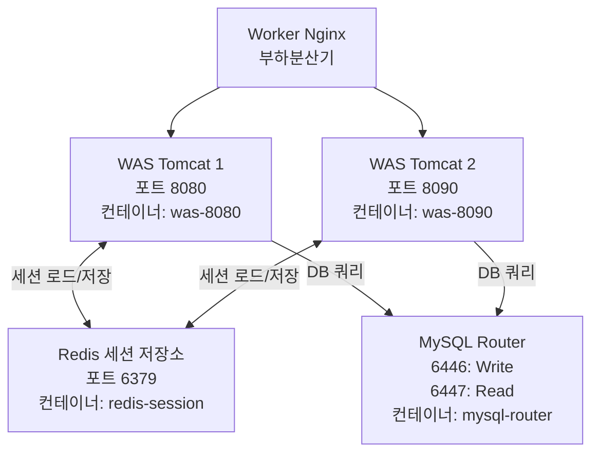

# Application Layer (애플리케이션 계층)

## 계층 아키텍처 다이어그램



## 개요

Application Layer는 비즈니스 로직을 처리하는 핵심 계층입니다. Java Servlet 기반의 WAS 2개 인스턴스가 Redis를 통해 세션을 공유하며, MySQL Router를 통해 데이터베이스에 접근합니다.

## 주요 컴포넌트

### WAS (Web Application Server)

**역할**: Tomcat 기반 Java Servlet 애플리케이션 서버

**주요 기능**:
- HTTP 요청 수신 및 비즈니스 로직 처리
- 필터 체인을 통한 요청 전처리
- Redis 기반 세션 관리
- MySQL 데이터베이스 연동

**컨테이너 정보**:
- 이미지: `tomcat:9-jdk17`
- 컨테이너명: `was-8080`, `was-8090`
- 포트: 
  - was-8080: `8080:8080` (호스트:컨테이너)
  - was-8090: `8090:8080` (호스트:컨테이너)
- WAR 파일: `card-history-3tier-system.war`

## 필터 체인 (Filter Chain)

WAS는 모든 요청을 처리하기 전에 3개의 필터를 순차적으로 실행합니다.

### 실행 순서

```
요청 → RedisSessionFilter → LoginSessionCheckFilter → EncodingFilter → Servlet
```

### 1. RedisSessionFilter

**파일**: `src/main/java/dev/filter/RedisSessionFilter.java`

**역할**: WAS의 세션을 Redis로 위임하여 세션 공유 구현

**주요 기능**:
- 쿠키에서 세션 ID 추출 (`REDIS_SESSION_ID`)
- Redis에서 세션 데이터 로드
- 요청 처리 후 세션 데이터를 Redis에 저장
- 정적 파일 요청은 세션 처리 생략 (성능 최적화)

**핵심 로직**:
```java
// Redis 접속 정보
private static final String REDIS_HOST = "redis-session";
private static final int REDIS_PORT = 6379;
private static final String COOKIE_NAME = "REDIS_SESSION_ID";

// 세션 데이터는 Java 직렬화 후 Base64로 인코딩하여 Redis에 저장
// TTL: 1800초 (30분)
```

**세션 공유 메커니즘**:
1. 클라이언트 요청 시 쿠키에서 세션 ID 확인
2. 세션 ID가 없으면 UUID 생성 후 쿠키에 저장
3. Redis에서 `session:{세션ID}` 키로 데이터 조회
4. 요청 처리 중 세션 데이터 변경
5. 요청 처리 완료 후 Redis에 세션 데이터 저장

### 2. LoginSessionCheckFilter

**파일**: `src/main/java/dev/filter/LoginSessionCheckFilter.java`

**역할**: 로그인 세션 유효성 검증

**주요 기능**:
- 세션에 `loggedInUser` 속성 존재 여부 확인
- 로그인되지 않은 사용자는 로그인 페이지로 리다이렉트
- AJAX 요청의 경우 JSON 에러 응답 반환
- 정적 리소스 및 로그인 페이지는 검증 제외

**제외 경로**:
- `/login.html` - 로그인 페이지
- `/login` - 로그인 엔드포인트
- `/static/*` - 정적 리소스
- `*.css`, `*.js` - CSS, JavaScript 파일

**핵심 로직**:
```java
// 세션 확인
HttpSession session = request.getSession(false);
if (session != null && session.getAttribute("loggedInUser") != null) {
    // 로그인 상태 - 요청 처리 계속
    chain.doFilter(request, response);
} else {
    // 미로그인 상태 - 로그인 페이지로 리다이렉트
    response.sendRedirect("/login.html");
}
```

### 3. EncodingFilter

**파일**: `src/main/java/dev/filter/EncodingFilter.java`

**역할**: 요청/응답 인코딩을 UTF-8로 설정

**주요 기능**:
- 요청 인코딩: UTF-8
- 응답 인코딩: UTF-8
- 한글 깨짐 방지

**핵심 로직**:
```java
request.setCharacterEncoding("UTF-8");
response.setCharacterEncoding("UTF-8");
chain.doFilter(request, response);
```

## 세션 공유 아키텍처

### Redis 기반 세션 공유

**목적**: 2개의 WAS 인스턴스 간 세션 데이터 동기화

**동작 방식**:
1. 사용자가 WAS1에서 로그인
2. 세션 데이터가 Redis에 저장
3. 다음 요청이 WAS2로 라우팅되어도 Redis에서 동일한 세션 데이터 로드
4. 사용자는 끊김 없는 서비스 경험

**장점**:
- WAS 인스턴스 간 세션 일관성 보장
- WAS 재시작 시에도 세션 유지
- 수평 확장 용이 (WAS 추가 시에도 세션 공유)

### 세션 데이터 구조

```
Redis Key: session:{UUID}
Redis Value: Base64(Java Serialized Map<String, Object>)
TTL: 1800초 (30분)
```

## 데이터베이스 연결

### DataSource 설정

**파일**: `src/main/java/dev/common/ApplicationContextListener.java`

**역할**: HikariCP 기반 커넥션 풀 관리 및 읽기/쓰기 분리

**DataSource 구성**:

#### 1. Source DataSource (쓰기 전용)
```java
sourceConfig.setJdbcUrl("jdbc:mysql://mysql-router:6446/card_db");
sourceConfig.setReadOnly(false);
sourceConfig.setPoolName("SourcePool");
```

#### 2. Replica DataSource (읽기 전용)
```java
replicaConfig.setJdbcUrl("jdbc:mysql://mysql-router:6447/card_db");
replicaConfig.setReadOnly(true);
replicaConfig.setMaximumPoolSize(20);  // 읽기 요청이 많으므로 풀 크기 증가
replicaConfig.setPoolName("ReplicaPool");
```

### Servlet에서 DataSource 사용

**쓰기 작업 예시**:
```java
DataSource ds = ApplicationContextListener.getSourceDataSource(getServletContext());
// INSERT, UPDATE, DELETE 쿼리 실행
```

**읽기 작업 예시**:
```java
DataSource ds = ApplicationContextListener.getReplicaDataSource(getServletContext());
// SELECT 쿼리 실행
```

## 핵심 설정 파일

### src/main/webapp/WEB-INF/web.xml

**파일 설명**: 필터 체인 및 세션 클러스터링 설정

**주요 설정**:

```xml
<?xml version="1.0" encoding="UTF-8"?>
<web-app>
  <!-- 세션 클러스터링 활성화 -->
  <distributable/>
  
  <!-- 필터 정의 및 매핑 -->
  <filter>
    <filter-name>RedisSessionFilter</filter-name>
    <filter-class>dev.filter.RedisSessionFilter</filter-class>
  </filter>
  <filter-mapping>
    <filter-name>RedisSessionFilter</filter-name>
    <url-pattern>/*</url-pattern>
  </filter-mapping>
  
  <filter>
    <filter-name>EncodingFilter</filter-name>
    <filter-class>dev.filter.EncodingFilter</filter-class>
  </filter>
  <filter-mapping>
    <filter-name>EncodingFilter</filter-name>
    <url-pattern>/*</url-pattern>
  </filter-mapping>
  
  <filter>
    <filter-name>loginFilter</filter-name>
    <filter-class>dev.filter.LoginSessionCheckFilter</filter-class>
  </filter>
  <filter-mapping>
    <filter-name>loginFilter</filter-name>
    <url-pattern>/*</url-pattern>
  </filter-mapping>
</web-app>
```

**핵심 파라미터**:
- `<distributable/>`: 세션 클러스터링 활성화 (Redis 기반)
- `<url-pattern>/*</url-pattern>`: 모든 요청에 필터 적용
- 필터 실행 순서: web.xml에 정의된 순서대로 실행

## 요청 처리 흐름

1. Worker Nginx가 WAS로 요청 전달
2. **RedisSessionFilter**: Redis에서 세션 로드
3. **LoginSessionCheckFilter**: 로그인 여부 확인
4. **EncodingFilter**: UTF-8 인코딩 설정
5. **Servlet**: 비즈니스 로직 처리
   - 필요 시 DataSource를 통해 DB 접근
   - Source DataSource (쓰기) 또는 Replica DataSource (읽기)
6. **RedisSessionFilter**: 세션 데이터를 Redis에 저장
7. 응답 반환

## 고가용성 및 확장성

### 고가용성
- WAS 2개 인스턴스로 단일 장애점 제거
- Redis 기반 세션 공유로 WAS 장애 시에도 세션 유지

### 확장성
- WAS 인스턴스 추가 시 Worker Nginx의 upstream에 서버 추가
- Redis 세션 공유로 WAS 수평 확장 용이
- HikariCP 커넥션 풀로 DB 연결 효율화

## 관련 문서

- [Architecture Overview](./architecture-overview.md) - 전체 시스템 아키텍처
- [Presentation Layer](./presentation-layer.md) - Nginx 부하분산
- [Redis Session Store](./redis-session-store.md) - 세션 공유 상세
- [Data Layer](./data-layer.md) - MySQL Cluster 구조
