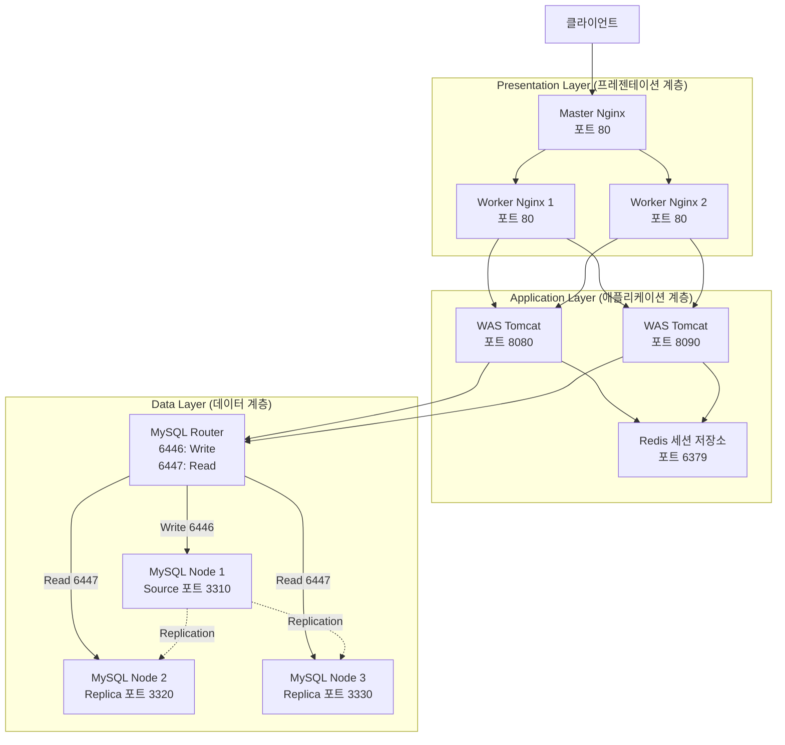
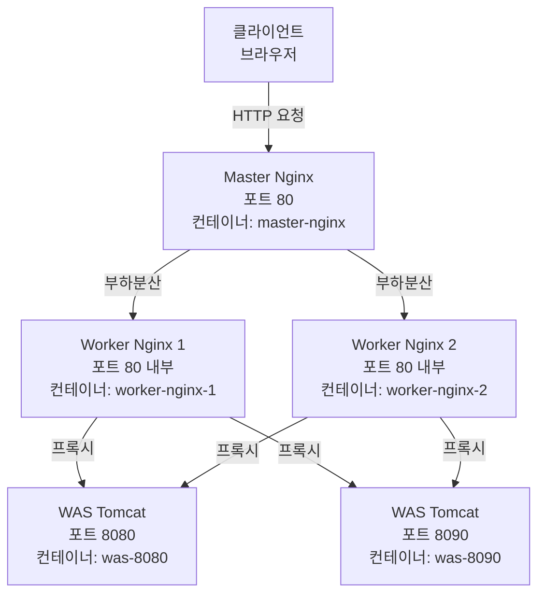
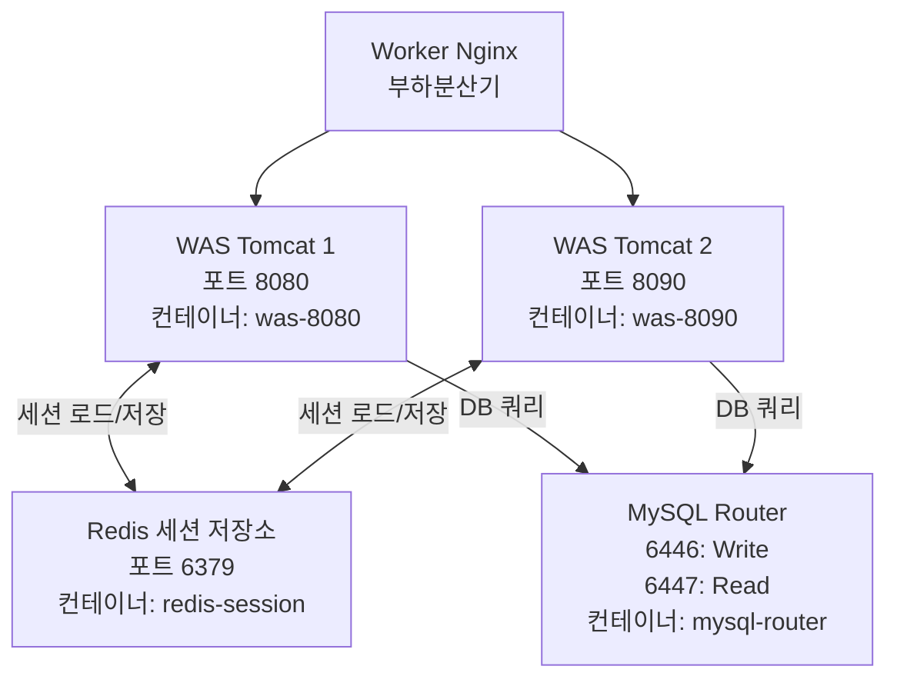

# 3-Tier 아키텍처 개요

## 시스템 개요

Docker 컨테이너로 구성된 **3-tier 아키텍처**를 기반으로 구현된 분기별 카드 거래내역 조회 시스템.

### 주요 특징

- **이중 부하분산**: Master Nginx → Worker Nginx(2개) 구조로 부하분산
- **세션 공유**: Redis를 통한 WAS 간 세션 동기화
- **읽기/쓰기 분리**: MySQL Router를 통해 읽기와 쓰기 데이터베이스 부하 분산

## 요청 처리 흐름



1. **클라이언트 요청**: 사용자가 브라우저에서 HTTP 요청 전송 (포트 80)

2. **Master Nginx**: 
   - 외부 요청을 수신
   - 2개의 Worker Nginx로 요청 전달

3. **Worker Nginx**:
   - Master Nginx로부터 요청 수신
   - 2개의 WAS 인스턴스로 요청 전달

4. **WAS 필터 체인**:
   - **RedisSessionFilter**: Redis에서 세션 데이터 로드/저장
   - **LoginSessionCheckFilter**: 로그인 세션 유효성 검증
   - **EncodingFilter**: UTF-8 인코딩 설정

5. **비즈니스 로직 처리**:
   - Servlet에서 요청 처리
   - 필요 시 MySQL Router를 통해 데이터베이스 접근

6. **데이터베이스 접근**:
   - **쓰기 작업**: MySQL Router 포트 6446 → Source 노드 (3310)
   - **읽기 작업**: MySQL Router 포트 6447 → Replica 노드 (3320, 3330)

7. **응답 반환**: 역순으로 응답이 클라이언트에게 전달

## 기술 스택

- **웹 서버**: Nginx
- **애플리케이션 서버**: Apache Tomcat 9 (JDK 17)
- **프로그래밍 언어**: Java (Servlet API)
- **세션 저장소**: Redis
- **데이터베이스**: MySQL 8.0 (MySQL Router + Cluster)
- **컨테이너화**: Docker & Docker Compose

## Layer

### Presentation-Layer


### 1. Master-Nginx

**역할**: 
- 외부 클라이언트 요청의 진입 및 1차 분산 지점
- 요청을 2개의 `Worker-Nginx`로 분산
- **포트**: `80`
- **인스턴스**: 1개


### 2. Worker-Nginx
- **역할**: Master-Nginx로부터 받은 요청을 WAS로 분산
- **포트**: `80` (내부)
- **인스턴스**: 2개 (`worker-nginx-1`, `worker-nginx-2`)

## 핵심 설정 파일

### 1. docker/nginx/master-nginx.conf

**파일 설명**: Master Nginx upstream 설정 (Worker Nginx 2개로 부하분산)

**주요 설정**:

```nginx
events {
    worker_connections 1024;
}

http {
    # upstream: 백엔드 서버 그룹
    upstream web-cluster {
        server worker-nginx-1:80;
        server worker-nginx-2:80;
    }

    server {
        listen 80;
        server_name localhost;

        location / {
            proxy_pass http://web-cluster;
            
            proxy_set_header Host $host;
            proxy_set_header X-Real-IP $remote_addr;
            proxy_set_header X-Forwarded-For $proxy_add_x_forwarded_for;
        }
    }
}
```

### 2. docker/nginx/nginx.conf

**파일 설명**: Worker Nginx upstream 설정 (WAS 2개로 부하분산)

**주요 설정**:

```nginx
events {
    worker_connections 1024;
}

http {
    # upstream: 백엔드 서버 그룹
    upstream was-cluster {
        server was-8080:8080;
        server was-8090:8080;
    }

    server {
        listen 80;
        server_name localhost;

        location / {
            # 모든 요청을 was-cluster로 전달
            proxy_pass http://was-cluster;
            
            proxy_set_header Host $host;
            proxy_set_header X-Real-IP $remote_addr;
            proxy_set_header X-Forwarded-For $proxy_add_x_forwarded_for;
        }
    }
}
```

### Aplication-Layer
 Java Servlet 기반의 WAS 2개 인스턴스가 Redis를 통해 세션을 공유하며, MySQL Router를 통해 데이터베이스에 접근

### 1. WAS (Web Application Server)
- **역할**: `Tomcat` 기반 `Java Servlet` 애플리케이션 서버
- **컨테이너명**: `was-8080`, `was-8090`
- **포트**: 
  - was-8080: `8080:8080` (호스트:컨테이너)
  - was-8090: `8090:8080` (호스트:컨테이너)
- WAR 파일: `card-history-3tier-system.war`

### 2. Redis
- **역할**: WAS 간 `세션 공유`를 위한 중앙 저장소
- **포트**: `6379`
- **인스턴스**: 1개

## 필터 체인 (Filter Chain)

WAS는 모든 요청을 처리하기 전에 3개의 필터를 순차적으로 실행합니다.

### 실행 순서

```
RedisSessionFilter → LoginSessionCheckFilter → EncodingFilter → Servlet
```

### 1. RedisSessionFilter

**파일**: `src/main/java/dev/filter/RedisSessionFilter.java`

**역할**: WAS의 세션을 Redis로 위임하여 세션 공유 구현

**주요 기능**:
- 쿠키에서 세션 ID 추출 (`REDIS_SESSION_ID`)
- Redis에서 세션 데이터 로드
- 요청 처리 후 세션 데이터를 Redis에 저장

**핵심 로직**:
Reies 접속 정보 및 cookie 이름 지정
```java
// Redis 접속 정보
private static final String REDIS_HOST = "redis-session";
private static final int REDIS_PORT = 6379;
private static final String COOKIE_NAME = "REDIS_SESSION_ID";
```
### 2. LoginSessionCheckFilter

**파일**: `src/main/java/dev/filter/LoginSessionCheckFilter.java`

**역할**: 로그인 세션 유효성 검증

**주요 기능**:
- 세션에 `loggedInUser` 속성 존재 여부 확인
- 로그인되지 않은 사용자는 로그인 페이지로 리다이렉트
- 정적 리소스 및 로그인 페이지는 검증 제외

**제외 경로**:
- `/login.html` - 로그인 페이지
- `/login` - 로그인 엔드포인트
- `/static/*` - 정적 리소스
- `*.css`, `*.js` - CSS, JavaScript 파일

**핵심 로직**:
세션 검증 및 처리
```java
// 세션 확인
HttpSession session = request.getSession(false);
if (session != null && session.getAttribute("loggedInUser") != null) {
    // 로그인 상태 - 요청 처리 계속
    chain.doFilter(request, response);
} else {
    // 미로그인 상태 - 로그인 페이지로 리다이렉트
    response.sendRedirect("/login.html");
}
```

### 5. MySQL Router
- **역할**: 읽기/쓰기 요청을 적절한 MySQL 노드로 라우팅
- **포트**: 
  - 6446 (Write - Source 노드)
  - 6447 (Read - Replica 노드)

### 6. MySQL Cluster
- **역할**: 데이터 저장 및 복제
- **구성**:
  - Node 1 (Source): 쓰기 전용, 포트 3310
  - Node 2 (Replica): 읽기 전용, 포트 3320
  - Node 3 (Replica): 읽기 전용, 포트 3330