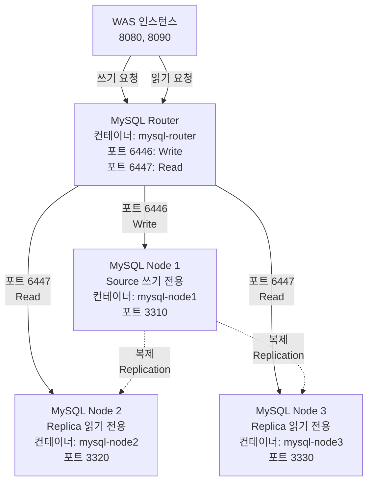

# Data Layer (데이터 계층)

## 계층 아키텍처 다이어그램



## 개요

Data Layer는 MySQL Cluster를 기반으로 데이터를 저장하고 관리합니다. MySQL Router를 통해 읽기/쓰기 요청을 분리하여 데이터베이스 부하를 효율적으로 분산합니다.

## 주요 컴포넌트

### 1. MySQL Router

**역할**: 읽기/쓰기 요청을 적절한 MySQL 노드로 라우팅

**주요 기능**:
- **포트 6446 (Write)**: 쓰기 요청을 Source 노드로 라우팅
- **포트 6447 (Read)**: 읽기 요청을 Replica 노드로 라운드 로빈 방식 분산

**컨테이너 정보**:
- 이미지: `mysql/mysql-router:8.0`
- 컨테이너명: `mysql-router`
- 포트: 
  - `6446:6446` (Write - Source)
  - `6447:6447` (Read - Replica)

**라우팅 전략**:
- **쓰기 작업** (INSERT, UPDATE, DELETE): 포트 6446 → mysql-node1 (Source)
- **읽기 작업** (SELECT): 포트 6447 → mysql-node2, mysql-node3 (Replica, 라운드 로빈)

### 2. MySQL Node 1 (Source)

**역할**: 쓰기 전용 마스터 노드

**주요 기능**:
- 모든 쓰기 작업 (INSERT, UPDATE, DELETE) 처리
- 변경 사항을 Replica 노드로 복제
- Binary Log 생성 및 관리

**컨테이너 정보**:
- 이미지: `mysql/mysql-server:8.0`
- 컨테이너명: `mysql-node1`
- 호스트명: `mysql-node1`
- 포트: `3310:3306` (호스트:컨테이너)
- 데이터 볼륨: `mysql-node1-data`

### 3. MySQL Node 2, 3 (Replica)

**역할**: 읽기 전용 슬레이브 노드

**주요 기능**:
- 읽기 작업 (SELECT) 처리
- Source 노드로부터 데이터 복제 수신
- 읽기 부하 분산

**컨테이너 정보**:

**Node 2**:
- 이미지: `mysql/mysql-server:8.0`
- 컨테이너명: `mysql-node2`
- 호스트명: `mysql-node2`
- 포트: `3320:3306` (호스트:컨테이너)
- 데이터 볼륨: `mysql-node2-data`

**Node 3**:
- 이미지: `mysql/mysql-server:8.0`
- 컨테이너명: `mysql-node3`
- 호스트명: `mysql-node3`
- 포트: `3330:3306` (호스트:컨테이너)
- 데이터 볼륨: `mysql-node3-data`

## 읽기/쓰기 분리 아키텍처

### 쓰기 작업 흐름

1. WAS에서 쓰기 쿼리 실행 (INSERT, UPDATE, DELETE)
2. Source DataSource 사용 (`jdbc:mysql://mysql-router:6446/card_db`)
3. MySQL Router가 포트 6446으로 요청 수신
4. MySQL Node 1 (Source)로 쿼리 전달
5. Source 노드에서 쿼리 실행 및 Binary Log 기록
6. Binary Log를 통해 Replica 노드로 변경 사항 복제

### 읽기 작업 흐름

1. WAS에서 읽기 쿼리 실행 (SELECT)
2. Replica DataSource 사용 (`jdbc:mysql://mysql-router:6447/card_db`)
3. MySQL Router가 포트 6447로 요청 수신
4. MySQL Node 2 또는 Node 3 (Replica)로 쿼리 전달 (라운드 로빈)
5. Replica 노드에서 쿼리 실행 및 결과 반환

### 복제 (Replication)

- **복제 방식**: GTID (Global Transaction Identifier) 기반 복제
- **복제 방향**: Source (Node 1) → Replica (Node 2, 3)
- **복제 지연**: 비동기 복제 (일반적으로 수 밀리초 이내)

## 핵심 설정 파일

### 1. docker/mysql/node1.cnf

**파일 설명**: MySQL Source 노드 설정 (쓰기 전용)

**주요 설정**:

```ini
[mysqld]
# 서버 식별자 (클러스터 내 고유값)
server-id=1

# Binary Log 활성화 (복제를 위한 변경 로그)
log-bin=mysql-bin

# GTID 모드 활성화 (글로벌 트랜잭션 ID)
gtid-mode=ON
enforce-gtid-consistency=ON

# Binary Log 형식 (ROW: 행 단위 복제)
binlog-format=ROW

# 슬레이브 업데이트도 Binary Log에 기록
log-slave-updates=ON

# 복제 시 호스트 이름 보고
report-host=mysql-node1
```

**핵심 파라미터**:
- `server-id=1`: 클러스터 내 서버 고유 식별자 (Source는 1)
- `log-bin=mysql-bin`: Binary Log 파일명 접두사
- `gtid-mode=ON`: GTID 기반 복제 활성화
- `binlog-format=ROW`: 행 단위 복제 (데이터 일관성 보장)
- `report-host=mysql-node1`: 복제 토폴로지에서 호스트 이름 표시

### 2. docker/mysql/node2.cnf

**파일 설명**: MySQL Replica 노드 설정 (읽기 전용)

**주요 설정**:

```ini
[mysqld]
# 서버 식별자 (클러스터 내 고유값)
server-id=2

# Binary Log 활성화 (체인 복제 지원)
log-bin=mysql-bin

# GTID 모드 활성화
gtid-mode=ON
enforce-gtid-consistency=ON

# Binary Log 형식
binlog-format=ROW

# 슬레이브 업데이트도 Binary Log에 기록
log-slave-updates=ON

# 복제 시 호스트 이름 보고
report-host=mysql-node2
```

**핵심 파라미터**:
- `server-id=2`: 클러스터 내 서버 고유 식별자 (Replica는 2)
- `log-slave-updates=ON`: 복제받은 변경사항도 Binary Log에 기록 (체인 복제 지원)
- 나머지 설정은 Source와 동일 (복제 일관성 유지)

### 3. docker/mysql/node3.cnf

**파일 설명**: MySQL Replica 노드 설정 (읽기 전용)

**주요 설정**:

```ini
[mysqld]
# 서버 식별자 (클러스터 내 고유값)
server-id=3

# Binary Log 활성화 (체인 복제 지원)
log-bin=mysql-bin

# GTID 모드 활성화
gtid-mode=ON
enforce-gtid-consistency=ON

# Binary Log 형식
binlog-format=ROW

# 슬레이브 업데이트도 Binary Log에 기록
log-slave-updates=ON

# 복제 시 호스트 이름 보고
report-host=mysql-node3
```

**핵심 파라미터**:
- `server-id=3`: 클러스터 내 서버 고유 식별자 (Replica는 3)
- 설정은 Node 2와 동일 (server-id와 report-host만 다름)

## GTID 기반 복제

### GTID란?

GTID (Global Transaction Identifier)는 MySQL 5.6부터 도입된 글로벌 트랜잭션 식별자입니다.

**형식**: `source_id:transaction_id`
- 예: `3E11FA47-71CA-11E1-9E33-C80AA9429562:1`

### GTID의 장점

1. **자동 페일오버**: Source 장애 시 Replica가 자동으로 올바른 복제 위치 찾기
2. **복제 일관성**: 트랜잭션 중복 실행 방지
3. **복제 토폴로지 변경 용이**: Replica를 다른 Source로 쉽게 전환

### 복제 설정

```sql
-- Source 노드에서 복제 사용자 생성
CREATE USER 'repl'@'%' IDENTIFIED BY 'password';
GRANT REPLICATION SLAVE ON *.* TO 'repl'@'%';

-- Replica 노드에서 복제 설정
CHANGE MASTER TO
  MASTER_HOST='mysql-node1',
  MASTER_USER='repl',
  MASTER_PASSWORD='password',
  MASTER_AUTO_POSITION=1;  -- GTID 자동 위치 지정

START SLAVE;
```

## 데이터 일관성 및 복제 지연

### 복제 지연 모니터링

```sql
-- Replica 노드에서 복제 상태 확인
SHOW SLAVE STATUS\G

-- 주요 확인 항목:
-- Seconds_Behind_Master: 복제 지연 시간 (초)
-- Slave_IO_Running: IO 스레드 상태 (Yes여야 함)
-- Slave_SQL_Running: SQL 스레드 상태 (Yes여야 함)
```

### 복제 지연 최소화 전략

1. **비동기 복제**: 쓰기 성능 우선 (일반적으로 수 밀리초 지연)
2. **네트워크 최적화**: 동일 네트워크 내 배치 (Docker 네트워크)
3. **Replica 리소스**: 읽기 부하에 따라 Replica 인스턴스 추가

## 고가용성 및 확장성

### 고가용성

**Replica 다중화**:
- Replica 2개로 읽기 부하 분산
- 한 Replica 장애 시 나머지 Replica가 읽기 처리

**Source 장애 대응**:
- Replica를 Source로 승격 (Manual Failover)
- GTID 기반 복제로 데이터 일관성 보장

### 확장성

**읽기 확장**:
- Replica 인스턴스 추가로 읽기 성능 향상
- MySQL Router가 자동으로 부하 분산

**쓰기 확장**:
- 샤딩 (Sharding) 또는 파티셔닝 (Partitioning) 고려
- 현재 구조는 단일 Source (쓰기 확장 제한)

## 백업 및 복구

### 백업 전략

**Replica 노드 활용**:
- Replica 노드에서 백업 수행 (Source 부하 최소화)
- mysqldump 또는 물리적 백업 (Percona XtraBackup)

**백업 명령 예시**:
```bash
# Replica 노드에서 논리적 백업
docker exec mysql-node2 mysqldump -u root -p card_db > backup.sql

# 물리적 백업 (볼륨 스냅샷)
docker run --rm --volumes-from mysql-node2 -v $(pwd):/backup \
  ubuntu tar cvf /backup/mysql-node2-backup.tar /var/lib/mysql
```

## 관련 문서

- [Architecture Overview](./architecture-overview.md) - 전체 시스템 아키텍처
- [Application Layer](./application-layer.md) - WAS의 DataSource 설정
