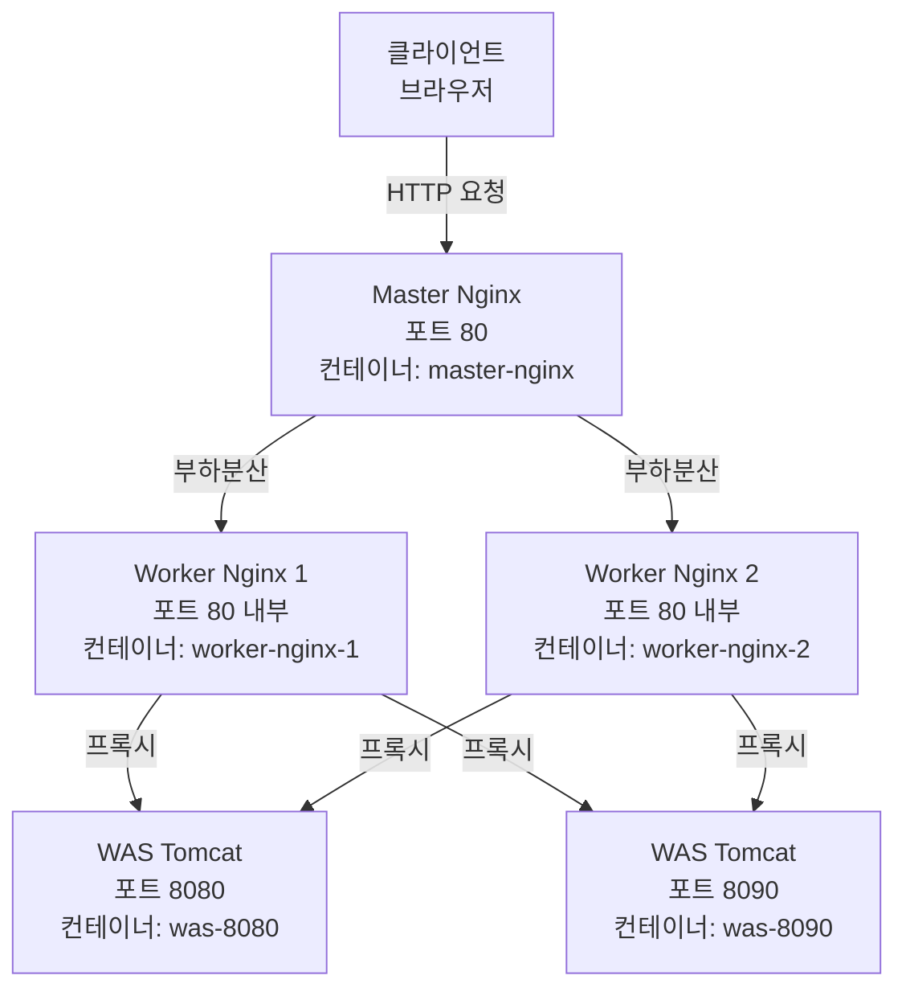

# Presentation Layer (프레젠테이션 계층)

## 계층 아키텍처 다이어그램



## 개요

Presentation Layer는 클라이언트의 HTTP 요청을 받아 애플리케이션 서버로 전달하는 역할을 담당합니다. 이중 부하분산 구조를 통해 트래픽을 효율적으로 분산하고 고가용성을 보장합니다.

## 주요 컴포넌트

### 1. Master Nginx

**역할**: 외부 클라이언트 요청의 진입점이자 1차 부하분산기

**주요 기능**:
- 외부 포트 80으로 들어오는 모든 HTTP 요청 수신
- 2개의 Worker Nginx 인스턴스로 라운드 로빈 방식 부하분산
- 클라이언트 IP 및 요청 헤더 정보 전달

**컨테이너 정보**:
- 이미지: `nginx:alpine`
- 컨테이너명: `master-nginx`
- 포트: `80:80` (호스트:컨테이너)

### 2. Worker Nginx (2개 인스턴스)

**역할**: Master Nginx로부터 요청을 받아 WAS로 2차 부하분산

**주요 기능**:
- Master Nginx로부터 전달받은 요청을 2개의 WAS 인스턴스로 라운드 로빈 방식 부하분산
- WAS로 요청 프록시 및 응답 반환
- 클라이언트 정보 헤더 설정 (X-Real-IP, X-Forwarded-For)

**컨테이너 정보**:
- 이미지: `nginx:alpine`
- 컨테이너명: `worker-nginx-1`, `worker-nginx-2`
- 포트: 내부 80 (expose only, 외부 노출 없음)

## 부하분산 전략

### 1단계: Master Nginx → Worker Nginx
- **알고리즘**: 라운드 로빈 (Round Robin)
- **대상**: worker-nginx-1:80, worker-nginx-2:80
- **목적**: Worker Nginx 레벨에서의 부하 분산

### 2단계: Worker Nginx → WAS
- **알고리즘**: 라운드 로빈 (Round Robin)
- **대상**: was-8080:8080, was-8090:8080
- **목적**: 애플리케이션 서버 레벨에서의 부하 분산

## 핵심 설정 파일

### 1. docker/nginx/master-nginx.conf

**파일 설명**: Master Nginx upstream 설정 (Worker Nginx 2개로 부하분산)

**주요 설정**:

```nginx
events {
    worker_connections 1024;
}

http {
    # upstream: 백엔드 서버 그룹
    upstream web-cluster {
        server worker-nginx-1:80;
        server worker-nginx-2:80;
    }

    server {
        listen 80;
        server_name localhost;

        location / {
            proxy_pass http://web-cluster;
            
            proxy_set_header Host $host;
            proxy_set_header X-Real-IP $remote_addr;
            proxy_set_header X-Forwarded-For $proxy_add_x_forwarded_for;
        }
    }
}
```

**핵심 파라미터**:
- `upstream web-cluster`: Worker Nginx 그룹 정의
- `server worker-nginx-1:80`: Worker Nginx 1번 인스턴스
- `server worker-nginx-2:80`: Worker Nginx 2번 인스턴스
- `proxy_pass http://web-cluster`: upstream으로 요청 전달
- `proxy_set_header Host $host`: 원본 호스트 헤더 유지
- `proxy_set_header X-Real-IP $remote_addr`: 클라이언트 실제 IP 전달
- `proxy_set_header X-Forwarded-For $proxy_add_x_forwarded_for`: 프록시 체인 정보 전달

### 2. docker/nginx/nginx.conf

**파일 설명**: Worker Nginx upstream 설정 (WAS 2개로 부하분산)

**주요 설정**:

```nginx
events {
    worker_connections 1024;
}

http {
    # upstream: 백엔드 서버 그룹
    upstream was-cluster {
        server was-8080:8080;
        server was-8090:8080;
    }

    server {
        listen 80;
        server_name localhost;

        location / {
            # 모든 요청을 was-cluster로 전달
            proxy_pass http://was-cluster;
            
            proxy_set_header Host $host;
            proxy_set_header X-Real-IP $remote_addr;
            proxy_set_header X-Forwarded-For $proxy_add_x_forwarded_for;
        }
    }
}
```

**핵심 파라미터**:
- `upstream was-cluster`: WAS 그룹 정의
- `server was-8080:8080`: WAS 1번 인스턴스 (컨테이너 내부 포트 8080)
- `server was-8090:8080`: WAS 2번 인스턴스 (컨테이너 내부 포트 8080)
- `proxy_pass http://was-cluster`: upstream으로 요청 전달
- `proxy_set_header`: 클라이언트 정보 헤더 전달 (Master Nginx와 동일)

## 트래픽 흐름 예시

1. 클라이언트가 `http://localhost/` 요청
2. Master Nginx가 요청 수신 (포트 80)
3. Master Nginx가 Worker Nginx 1 또는 2로 전달 (라운드 로빈)
4. Worker Nginx가 WAS 8080 또는 8090으로 전달 (라운드 로빈)
5. WAS가 요청 처리 후 응답 반환
6. 역순으로 응답이 클라이언트에게 전달

## 고가용성 및 확장성

### 고가용성
- Worker Nginx 2개 인스턴스로 단일 장애점(SPOF) 제거
- 한 Worker Nginx가 다운되어도 나머지 인스턴스가 트래픽 처리

### 확장성
- Worker Nginx 인스턴스 추가 시 `master-nginx.conf`의 upstream에 서버 추가
- WAS 인스턴스 추가 시 `nginx.conf`의 upstream에 서버 추가
- Docker Compose로 간편한 스케일 아웃

## 관련 문서

- [Architecture Overview](./architecture-overview.md) - 전체 시스템 아키텍처
- [Application Layer](./application-layer.md) - WAS 및 필터 체인
