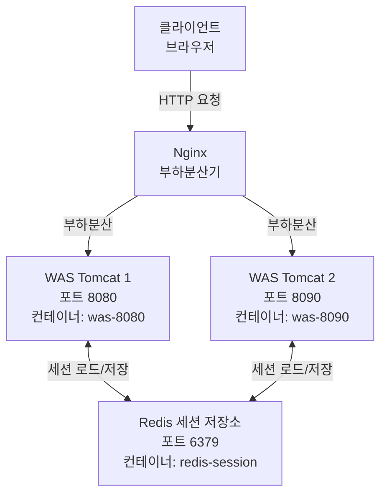

# Redis 세션 저장소

## 아키텍처 다이어그램



## 개요

Redis는 WAS 인스턴스 간 세션 데이터를 공유하기 위한 중앙 저장소 역할을 합니다. 이를 통해 사용자는 어느 WAS 인스턴스에 접속하더라도 동일한 세션 정보를 유지할 수 있습니다.

## Redis 컴포넌트

### 역할

**중앙 세션 저장소**: WAS 인스턴스 간 세션 데이터 동기화

### 주요 기능

- 세션 데이터 저장 및 조회
- 세션 TTL (Time To Live) 관리
- 고속 인메모리 데이터 접근

### 컨테이너 정보

- **이미지**: `redis:alpine`
- **컨테이너명**: `redis-session`
- **포트**: `6379:6379` (호스트:컨테이너)
- **네트워크**: `cluster-net` (Docker 내부 네트워크)

## 세션 공유 메커니즘

### 문제: WAS 인스턴스 간 세션 불일치

전통적인 WAS 세션 관리 방식에서는 각 WAS 인스턴스가 독립적으로 세션을 메모리에 저장합니다.

**문제점**:
1. 사용자가 WAS1에서 로그인
2. 다음 요청이 WAS2로 라우팅
3. WAS2는 세션 정보가 없어 사용자를 미로그인 상태로 인식
4. 사용자는 다시 로그인해야 함

### 해결: Redis 기반 중앙 세션 저장소

Redis를 중앙 저장소로 사용하여 모든 WAS 인스턴스가 동일한 세션 데이터에 접근합니다.

**동작 방식**:
1. 사용자가 WAS1에서 로그인
2. WAS1이 세션 데이터를 Redis에 저장
3. 다음 요청이 WAS2로 라우팅
4. WAS2가 Redis에서 세션 데이터 로드
5. 사용자는 끊김 없이 서비스 이용

## RedisSessionFilter 동작 원리

### 필터 역할

`RedisSessionFilter`는 WAS의 표준 세션 API를 가로채서 Redis로 위임하는 필터입니다.

**파일**: `src/main/java/dev/filter/RedisSessionFilter.java`

### 세션 ID 관리

**쿠키 기반 세션 ID**:
- 쿠키 이름: `REDIS_SESSION_ID`
- 값: UUID (예: `3e11fa47-71ca-11e1-9e33-c80aa9429562`)
- 경로: `/` (모든 경로에서 유효)

### 세션 데이터 저장 형식

**Redis Key**: `session:{세션ID}`
- 예: `session:3e11fa47-71ca-11e1-9e33-c80aa9429562`

**Redis Value**: Base64 인코딩된 Java 직렬화 데이터
- 원본: `Map<String, Object>` (세션 속성 맵)
- 직렬화: Java ObjectOutputStream
- 인코딩: Base64

**TTL (Time To Live)**: 1800초 (30분)
- 세션 만료 시간: 마지막 접근 후 30분
- Redis가 자동으로 만료된 세션 삭제

### 요청 처리 흐름

#### 1. 요청 수신 시 (세션 로드)

```
1. 클라이언트 요청 수신
2. 쿠키에서 REDIS_SESSION_ID 추출
3. 세션 ID가 없으면:
   - 새 UUID 생성
   - 쿠키에 REDIS_SESSION_ID 저장
4. Redis에서 session:{세션ID} 조회
5. 데이터가 있으면:
   - Base64 디코딩
   - Java 역직렬화
   - Map<String, Object>로 복원
6. 세션 객체 생성 및 요청 처리
```

#### 2. 요청 처리 완료 시 (세션 저장)

```
1. 세션이 사용되었는지 확인
2. 세션이 사용되었으면:
   - Map<String, Object>를 Java 직렬화
   - Base64 인코딩
   - Redis에 SETEX 명령으로 저장 (TTL: 1800초)
3. 응답 반환
```

### 코드 예시

**세션 데이터 저장**:
```java
// RedisSessionFilter.java
public void saveToRedis() {
    try (Jedis jedis = new Jedis("redis-session", 6379)) {
        // Map을 직렬화
        ByteArrayOutputStream baos = new ByteArrayOutputStream();
        ObjectOutputStream oos = new ObjectOutputStream(baos);
        oos.writeObject(attributes);
        
        // Base64 인코딩
        String base64Data = Base64.getEncoder().encodeToString(baos.toByteArray());
        
        // Redis에 저장 (TTL: 1800초)
        jedis.setex("session:" + id, 1800, base64Data);
    }
}
```

**세션 데이터 로드**:
```java
// RedisSessionFilter.java
public void loadFromRedis() {
    try (Jedis jedis = new Jedis("redis-session", 6379)) {
        // Redis에서 조회
        String base64Data = jedis.get("session:" + id);
        
        if (base64Data != null) {
            // Base64 디코딩
            byte[] data = Base64.getDecoder().decode(base64Data);
            
            // 역직렬화
            ByteArrayInputStream bais = new ByteArrayInputStream(data);
            ObjectInputStream ois = new ObjectInputStream(bais);
            attributes = (Map<String, Object>) ois.readObject();
        }
    }
}
```

## 세션 공유 시나리오

### 시나리오 1: 로그인 후 다른 WAS로 라우팅

1. **사용자가 WAS1에 로그인 요청**
   - LoginServlet이 사용자 인증
   - `session.setAttribute("loggedInUser", userId)` 호출
   - RedisSessionFilter가 세션 데이터를 Redis에 저장

2. **다음 요청이 WAS2로 라우팅**
   - 클라이언트가 쿠키에 REDIS_SESSION_ID 포함하여 요청
   - WAS2의 RedisSessionFilter가 Redis에서 세션 로드
   - `session.getAttribute("loggedInUser")` 호출 시 userId 반환
   - 사용자는 로그인 상태 유지

### 시나리오 2: WAS 재시작

1. **WAS1이 재시작되는 동안**
   - Nginx가 모든 요청을 WAS2로 라우팅
   - WAS2가 Redis에서 세션 로드하여 정상 서비스

2. **WAS1 재시작 완료 후**
   - WAS1도 Redis에서 세션 로드
   - 사용자는 세션 손실 없이 서비스 이용

### 시나리오 3: 세션 만료

1. **사용자가 30분 동안 활동 없음**
   - Redis가 TTL 만료로 세션 자동 삭제

2. **다음 요청 시**
   - RedisSessionFilter가 Redis에서 세션 조회 실패
   - LoginSessionCheckFilter가 미로그인 상태로 판단
   - 로그인 페이지로 리다이렉트

## 성능 최적화

### 정적 파일 제외

RedisSessionFilter는 정적 파일 요청에 대해 세션 처리를 생략합니다.

**제외 대상**:
- `*.css` - CSS 파일
- `*.png`, `*.jpg`, `*.jpeg`, `*.gif` - 이미지 파일
- `*.ico` - 파비콘

**이유**:
- 정적 파일은 세션 정보가 필요 없음
- Redis 조회 횟수 감소로 성능 향상
- 로그 도배 방지

### Redis 연결 관리

**Jedis 클라이언트 사용**:
- 각 요청마다 새 연결 생성 및 종료 (try-with-resources)
- 연결 풀 미사용 (간단한 구조)

**개선 가능 사항**:
- JedisPool 사용으로 연결 재사용
- 연결 풀 크기 조정으로 성능 최적화

## 중앙 집중식 세션 저장의 이점

### 1. 세션 일관성

- 모든 WAS 인스턴스가 동일한 세션 데이터 공유
- 사용자는 어느 WAS에 접속하더라도 동일한 경험

### 2. 수평 확장 용이

- WAS 인스턴스 추가 시 세션 공유 자동 지원
- 스케일 아웃 시 세션 마이그레이션 불필요

### 3. 세션 지속성

- WAS 재시작 시에도 세션 유지
- 배포 중 사용자 세션 손실 방지

### 4. 장애 복구

- WAS 장애 시 다른 WAS가 세션 인계
- 사용자는 재로그인 없이 서비스 계속 이용

## 고가용성 고려사항

### Redis 단일 장애점 (SPOF)

**현재 구조**:
- Redis 1개 인스턴스
- Redis 장애 시 모든 세션 손실

**개선 방안**:
1. **Redis Sentinel**: 자동 페일오버
2. **Redis Cluster**: 데이터 샤딩 및 복제
3. **Redis Replication**: Master-Slave 구조

### 세션 백업

**현재 구조**:
- 인메모리 저장 (영속성 없음)
- Redis 재시작 시 세션 손실

**개선 방안**:
1. **RDB (Redis Database)**: 주기적 스냅샷
2. **AOF (Append Only File)**: 모든 쓰기 작업 로깅
3. **Redis Persistence 설정**: 데이터 영속성 보장

## 모니터링 및 디버깅

### Redis 명령어

**세션 조회**:
```bash
# Redis CLI 접속
docker exec -it redis-session redis-cli

# 모든 세션 키 조회
KEYS session:*

# 특정 세션 조회
GET session:3e11fa47-71ca-11e1-9e33-c80aa9429562

# 세션 TTL 확인
TTL session:3e11fa47-71ca-11e1-9e33-c80aa9429562

# 세션 삭제
DEL session:3e11fa47-71ca-11e1-9e33-c80aa9429562
```

### 로그 확인

**WAS 로그**:
```bash
# WAS 컨테이너 로그 확인
docker logs was-8080
docker logs was-8090

# 세션 관련 로그 필터링
docker logs was-8080 | grep "REDIS LOG"
```

**Redis 로그**:
```bash
# Redis 컨테이너 로그 확인
docker logs redis-session
```

## 관련 문서

- [Architecture Overview](./architecture-overview.md) - 전체 시스템 아키텍처
- [Application Layer](./application-layer.md) - RedisSessionFilter 상세 설명
- [Presentation Layer](./presentation-layer.md) - Nginx 부하분산
